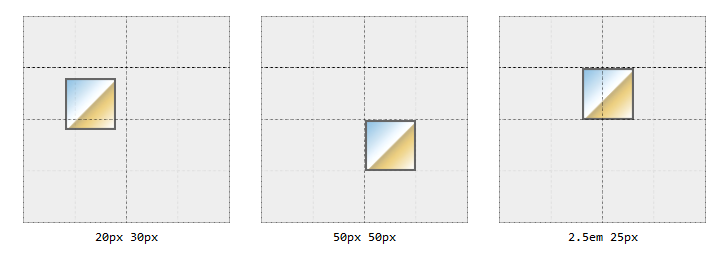
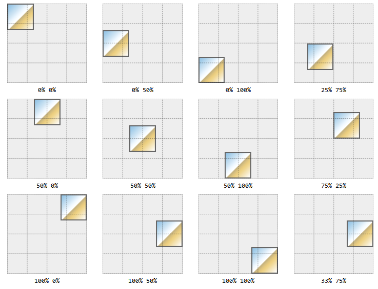

# Background Images

## `background-position`

The `background-position` property applies to block-level and replaced elements
and defaults to `0%, 0%` (`top, left`).

There can be multiple background images. The first positioned image is called
the _origin image_.

A `position` can be:

```
            [ [ left | center | right | top | bottom | <percentage> | <length> ]
          | [ left | center | right | <percentage> | <length> ]
            [ top | center | bottom | <percentage> | <length> ]
          | [ center | [ left | right ] [ <percentage> | <length> ]? ]
         && [ center | [ top | bottom ] [ <percentage> | <length> ]? ] ]
```

**lengths**: can be given in any valid unit: `px em rem vw vh` and always
represent where the image's `top, left` corner is to be placed in relation to
the element's background `top, left` (0,0) corner i.e. `20px 30px` would move
the top, left corner of the image to the point `20px` to the right of the
background's left edge and `30px` down from the background's top edge.



**keywords**: can appear in any order, singly or in pairs. When used in pairs
there must be a vertical and a horizontal i.e. `top left` or `right bottom`

**percentages**: percentage values apply to **both** the element's background
and the image being positioned i.e. `50%, 50%` will align the center of the
image with the center of the element's background; `15%, 70%` will align the
point of the image 15% from its own left edge and 70% from its own top edge with
the point 15% from the element's background's left edge and 70% from the
element's background's top edge, and so on. If only one percentage value is
given the other value is assumed to be for the vertical (`y`) position with a
value of 50%.



The percentages relate to the keywords: `top left` both equate to 0%,
`bottom right` both equate to 100%, `center` equates to 50%. So `bottom left`
would equate to `0% 100%` since:

1. bottom -> vertical -> 100%
1. left -> horizontal -> 0%
1. value pairs are always evaluated in horizontal (`x`) and vertical (`y`) order
   -> `(x,y) -> (0%, 100%)`

### Mixing Lengths, Keywords, and Percentages

You can mix length, keyword, and percentage values **but** order will matter in
such cases, the first value will always be taken as the horizontal, the second,
as the vertical and if the keyword is not in agreement the _entire_ statement
will be ignored i.e. `background-position: bottom 20%` will be ignored; `bottom`
represents a vertical (`y`) value, not a horizontal (`x`) value.

### Negative Position Values

Negative values will push the image outside of the element's background viewing
area. Background images do not _overflow_, if you push the image or part of the
image past one or more of the background's edges it will be hidden from view.
i.e. if an image is 100px by 100px and you only want to show the bottom, right
corner you can use `background-position: -75px -75px` to move the image's top,
left corner 75px away from the the background's top, left corner leaving only a
25px by 25px area viewable in the background's top, left corner. (see a
[Codepen Example](https://codepen.io/janegca/details/vYypPLJ))

Negative percentage values can also be used but if the element and the image are
different sizes the results may not be quite what is expected. The same
percentage values will apply to both the element and the image but the actual
pixel correspondences will not.

### Supplying a new offset origin

You can use four values to change the origin of the offset i.e.
`left 33% top 30px` equates to "move right 33% from the left and move down 30px
from the top edge" or `right 25% bottom 30px` which equates to "move left 25%
from the right edge and up 30px from the bottom edge". Need to provide all four
values _unless_ you want one of them to be zero i.e. `right 25% bottom` equates
to "move left 25% from the right edge and 0% from the bottom edge".

You cannot use the `center` keyword in this context.

## `background-origin`

Use the `background-origin` property to change the containing box reference
point to one of `content-box`, `padding-box` (default) or `border-box`.

This setting, along with `background-repeat` effects where tiling of repeated
background elements begins and ends. There are two other options, `space` and
`round`, that also affect tiling.

## `background-clip`

Has the same three options as `background-origin` but describes the _painting
area_ rather than the containing area. The key difference appears to be that
`border-box` is transparent when used as an origin but not when used as a
clipping area.

## `background-attachment`

Has three options: `fixed`, `scroll`, and `local`. When `fixed` the background
is always visible in the viewport and is not affected by any scrolling.
Essentially, the background becomes the viewport's background, not the
containing element's background; however, once the containing element is
completely scrolled out of the viewport its background will disappear with it.

If set to `local` the background is fixed within the element and maintains its
position within the element as it is scrolled i.e. it can be scrolled in and out
of the viewport along with the element's contents.

If set to `scroll` the viewport size has not effect on the background, it
retains its position in the element and moves with the scrolled contents.

## `background-size`

Allows you to resize the image. Will take the values `contain`, `cover`, `auto`
or as `(x,y)` pairs in lengths or percentages. Percentage values use the
`background-origin` and not the `background-clip` area. Negative values are
ignored.

To maintain an image's intrinsic aspect-ratio when setting a new size, leave one
dimension as `auto`, the implicit aspect-ratio will be used re-calculate the
dimension's new size. i.e. if the original image is 300px by 200px it's
intrinsic aspect-ration is 3:2. If we set `background-size: 100px` the new
height will be 66.67px (2/3 of 100px). If instead we set
`background-size: auto 100px` the image will be resized to 150px by 100px, the
width will be 1.5 (3/2) times the height.

If an image has no intrinsic size (gradients, some SVG's) then the `auto`
dimension will default to 100% of the parent element's size.

If set to `cover` the image will scale to completely over the background's
positioning area. The intrinsic aspect-ratio is retained (which does not happen
if we use 100%,100%).

If set to `contain` the image will be scaled to fit within the element's
background positioning area. Again, the intrinsic aspect-ratio is retained.


The green is the difference between the `background-clip` area and the
`background-origin` area.

## `background`

The shortcut for background properties is:

```
  <bg-layer> = <bg-image> ‖ <position> [ / <bg-size> ]?
             ‖ <repeat-style>
             ‖ <attachment>
             ‖ <box> (background-origin)
             ‖ <box> (background-clip)

  <final-bg-layer> = <bg-image>
                   ‖ <position> [ /  <bg-size> ]?
                   ‖ <repeat-style>
                   ‖ <attachment>
                   ‖ <box> (background-origin)
                   ‖ <box> (background-clip)
                   ‖ <background-color>
```

If only one `<box>` value is given it applies to _both_ `background-clip` and
`background-origin`.

Note that if any option is omitted it defaults back to its initial setting.

## Multiple Backgrounds

Define multiple images as comma separated values, you can have as many as you
want with the exception that only _one_ background colour can be declared.

Layers can be defined using background shorthand or by setting individual
properties.

```css
section {
  background-image: url(bg01.png), url(bg02.gif), url(bg03.jpg);
  background-position: top right, left center, 50% 100%;
  background-repeat: no-repeat, no-repeat, repeat-x;
  background-color: green;
}
```

is equivalent to:

```css
section {
  background: url(bg01.png) right top no-repeat, url(bg02.gif) center left
      no-repeat, url(bg03.jpg) 50% 100% repeat-x green;
}
```

Note that the number of images sets the number of layers. If you set properties
individually, missing values are assumed. For example,

```css
section {
  background-image: url(one.png), url(two.png);
  background-repeat: no-repeat;
  background-position: top left;
}
```

is interpreted as:

```css
section {
  background-image: url(one.png), url(two.png);
  background-repeat: no-repeat, no-repeat;
  background-position: top left, top left;
}
```

The layers stack up, with the first layer being the bottom most last and the
only one which can have a background color. In the above example, `one.png` will
sit on top of `two.png` with both positioned in the top, left corner.

References:

- [CSS: The Definitive Guide, 4th Edition by Eric A. Meyer and Estelle Weyl](https://www.oreilly.com/library/view/css-the-definitive/9781449325053/)
  - images clipped from the
    [books example pages](https://meyerweb.github.io/csstdg4figs/09-colors-backgrounds-and-gradients/index.html)
