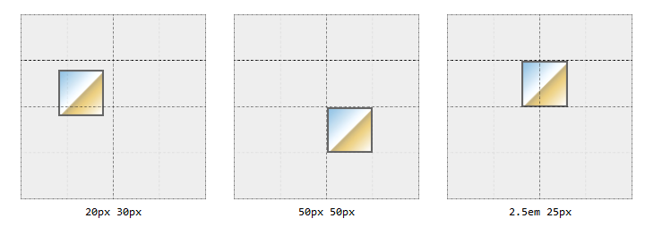
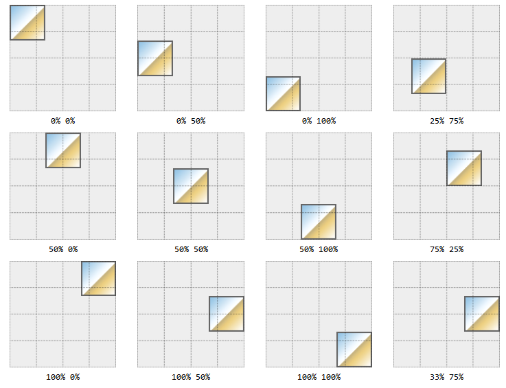

# Background Images

## `background-position`

The `background-position` property applies to block-level and replaced elements
and defaults to `0%, 0%` (`top, left`).

There can be multiple background images. The first positioned image is called
the _origin image_.

A `position` can be:

```syntax
            [ [ left | center | right | top | bottom | <percentage> | <length> ]
          | [ left | center | right | <percentage> | <length> ]
            [ top | center | bottom | <percentage> | <length> ]
          | [ center | [ left | right ] [ <percentage> | <length> ]? ]
         && [ center | [ top | bottom ] [ <percentage> | <length> ]? ] ]
```

**lengths**: can be given in any valid unit: `px em rem vw vh` and always
represent where the image's `top, left` corner is to be placed in relation to
the element's background `top, left` (0,0) corner i.e. `20px 30px` would move
the top, left corner of the image to the point `20px` to the right of the
background's left edge and `30px` down from the background's top edge.



**keywords**: can appear in any order, singly or in pairs. When used in pairs
there must be a vertical and a horizontal i.e. `top left` or `right bottom`

**percentages**: percentage values apply to **both** the element's background
and the image being positioned i.e. `50%, 50%` will align the center of the
image with the center of the element's background; `15%, 70%` will align the
point of the image 15% from its own left edge and 70% from its own top edge with
the point 15% from the element's background's left edge and 70% from the
element's background's top edge, and so on. If only one percentage value is
given the other value is assumed to be for the vertical (`y`) position with a
value of 50%.



The percentages relate to the keywords: `top left` both equate to 0%,
`bottom right` both equate to 100%, `center` equates to 50%. So `bottom left`
would equate to `0% 100%` since:

1. bottom -> vertical -> 100%
1. left -> horizontal -> 0%
1. value pairs are always evaluated in horizontal (`x`) and vertical (`y`) order
   -> `(x,y) -> (0%, 100%)`

### Mixing Lengths, Keywords, and Percentages

You can mix length, keyword, and percentage values **but** order will matter in
such cases, the first value will always be taken as the horizontal, the second,
as the vertical and if the keyword is not in agreement the _entire_ statement
will be ignored i.e. `background-position: bottom 20%` will be ignored; `bottom`
represents a vertical (`y`) value, not a horizontal (`x`) value.

### Negative Position Values

Negative values will push the image outside of the element's background viewing
area. Background images do not _overflow_, if you push the image or part of the
image past one or more of the background's edges it will be hidden from view.
i.e. if an image is 100px by 100px and you only want to show the bottom, right
corner you can use `background-position: -75px -75px` to move the image's top,
left corner 75px away from the the background's top, left corner leaving only a
25px by 25px area viewable in the background's top, left corner. (see a
[Codepen Example](https://codepen.io/janegca/details/vYypPLJ))

Negative percentage values can also be used but if the element and the image are
different sizes the results may not be quite what is expected. The same
percentage values will apply to both the element and the image but the actual
pixel correspondences will not.

References:

- [CSS: The Definitive Guide, 4th Edition by Eric A. Meyer and Estelle Weyl](https://www.oreilly.com/library/view/css-the-definitive/9781449325053/)
  - images clipped from the
    [books example pages](https://meyerweb.github.io/csstdg4figs/09-colors-backgrounds-and-gradients/index.html)
